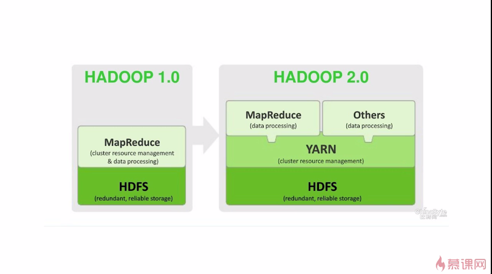

### Hadoop

#### 1、初识Hadoop

- HDFS
- MapReduce
- Hive SQL
- HBase 分布式数据库
- Zookeeper 管理员
- Spark
- Storm 

        ver2.x 不稳定
        ver1.2 稳定版
        
        

#### 2、Hadoop安装
 
- linux环境
- 安装jdk
- 配置hadoop

        wget http://mirror.bit.edu.cn/apache/hadoop/common/hadoop-1.2.1/hadoop-1.2.1.tar.gz
        
        wget http://mirror.bit.edu.cn/apache/hadoop/common/hadoop-2.8.1/hadoop-2.8.1.tar.gz 
        
        mv hadoop-1.2.1.tar.gz /opt
        
        tar -zxvf hadoop-1.2.1.tar.gz
        
        cd hadoop-1.2.1
        
        cd conf

    vim hadoop-env.sh、

        echo $JAVA_HOME  /usr/local/jdk1.7.0
    
    vim core-site.xml、

        <property>
        	<name>hadoop.tmp.dir</name>
        	<value>/hadoop</value>
        </property>	
        <property>
        	<name>dfs.name.dir</name>
        	<value>/hadoop/name</value>
        </property>	
        <property>
        	<name>fs.default.name</name>
        	<value>hdfs://localhost:9000</value>
        </property>	

    vim hdfs-site.xml、

        <property>
        	<name>dfs.data.dir</name>
        	<value>/hadoop/data</value>
        </property>
    
    vim mapred-site.xml

        <property>
        	<name>mapred.job.tracker</name>
        	<value>localhost:9001</value>
        </property>

    vim /etc/profile

        export HADOOP_HOME=/opt/hadoop-1.2.1
        PATH+ $HADOOP_HOME/bin:
        source /etc/profile

    cd ..
    cd bin
    ls
    
        #HMH1234hmh

        hadoop namenode -format
        
        start-all.sh
        
        jps
        
        http://hadoop.apache.org/docs/r1.2.1/single_node_setup.html
        http://119.23.206.15:50070/dfshealth.jsp
        http://119.23.206.15:50030/jobtracker.jsp
        
        hadoop fs -ls /
        
#### 3、Hadoop核心-HDFS简介  
   
        HDFS-系统 
        MapReduce-框架   
        
- 块(Block) 
    
        默认大小64MB，块是文件存储处理的逻辑单元
        
两类节点：
- NameNode
    
        管理节点，存放文件元数据
        1)文件与数据块的映射表
        2)数据块与数据节点的映射表
        NameNode SecondaryNameNode
        读取元数据
        
        二级NameNode定期同步元数据映像文件FsImage和修改日志Editlog，
        NameNode发生故障时，备胎转正。

- DataNode        

        工作节点，存放数据块
        每个数据块3个副本，分布在两个机架内的三个节点。
        每个节点三个数据块
        
        心跳检测：DataNode定期向NameNode发送心跳消息。
        
文件读取过程：
        
        1) 客户端发送文件读取请求到NameNode
        2) NameNode返回元数据
        3) 根据元数据，到指定DataNode读取数据块
        
文件写入过程：
        1) 客户端文件拆分每块64MB,请求NameNode
        2) NameNode返回DataNodes
        3) 往指定DataNode写入Blocks
        4) 流水线复制
        5) 更新NameNode元数据
            
HDFS特点：
            
        1) 数据冗余、硬件容错
        2) 流式数据访问
        3) 适合存储大文件
        
        适合数据批量读写，吞吐量高；
        适合一次写入多次读取，顺序读写
        
        不适合交互式应用，低延迟很难满足；
        不支持多用户并发写相同文件
        
HDFS使用：
        
        hadoop namenode -format
        hadoop fs -ls /
        hadoop fs -mkdir input
        hadoop fs -ls /user/root
        hadoop fs -put hadoop-env.sh input/
        hadoop fs -ls /user/root/input
        hadoop fs -cat /user/root/input/hadoop-env.sh
        
        hadoop fs -get input/hadoop-env.sh hadoop-env2.sh
        
        hadoop dfsadmin -report
                                                    
#### 4、Hadoop核心-MapReduce原理与实现

原理：

- Map 
- Reduce

        分牌      各自统计    再次统计    筛选出结果
        input   map tasks   reduce tasks output
        
        split0  map()       
        split1  map()       reduce()    part0
        split2  map()       reduce()    part1
        split3  map()       reduce()    part2
        split4  map()
        
        input split   shuffle交换!!!    output

运行流程：

- Job & Task(MapTask、ReduceTask)
- JobTracker管理者：作业调度，分配任务、监控任务执行进度，监控TaskTracker的状态
- TaskTracker执行者：执行任务，汇报任务状态

        1) 客户端发送一个Job给JobTracker
        2) JobTracker把Job分发
           一个MapTask给Map TaskTracker，
           一个ReduceTask给Reduce TaskTracker

MapReduce的容错机制：
    
        1) 重复执行
        2）推测执行
       
#### 5、开发Hadoop应用程序

- WordCount单词计数

        1) 编写WordCount.java，和本地输入文件file1 file2
        
        cd /root/example/word_count
        ls
        input word_count_class WordCount.java
        
        cd input
        vim file1
        hello world
        hello hadoop
        hadoop file system
        hadoop java api
        hello java 
        vim file2
        new file 
        hadoop file 
        hadoop new world
        hadoop free home
        hadoop free school
        
        提交到hadoop
        hadoop fs -mkdir input_wordcount
        hadoop fs -put /root/example/word_count/input/* input_wordcount/
        
        2) 编译WordCount.java javac -classpath
        
        cd /root/example/word_count/
        javac -classpath /opt/hadoop-1.2.1/hadoop-core-1.2.1.jar:/opt/hadoop-1.2.1/lib/commons-cli-1.2.jar -d word_count_class/ WordCount.java
        
        3) 打包jar -cvf WordCount.jar classes/*
        
        打包
        cd word_count_class
        jar -cvf wordcount.jar *.class
        
        4) 作业提交 hadoop.jar WordCount.jar WordCount input output
        
        执行
        cd /root/example/word_count
        hadoop jar word_count_class/wordcount.jar WordCount input_wordcount output_wordcount
        
        执行结果：
        api		1
        file	3
        free	2
        hadoop	7
        hello	3
        home	1
        java	2
        new		2
        school	1
        system	1
        world	2
        
        

    